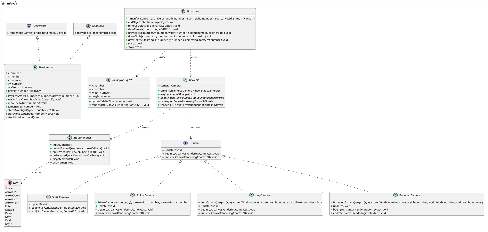

# Class diagram

Public API of the `timanfaya` package.

```plantuml
@startuml

package timanfaya {

  class Timanfaya {
    + Timanfaya(universe: Universe, width: number = 800, height: number = 600, canvasId: string = "canvas")
    + addObject(obj: TimanfayaObject): void
    + removeObject(obj: TimanfayaObject): void
    + clearCanvas(color: string = "#ffffff"): void
    + drawRect(x: number, y: number, width: number, height: number, color: string): void
    + drawCircle(x: number, y: number, radius: number, color: string): void
    + drawText(text: string, x: number, y: number, color: string, fontSize: number): void
    + start(): void
    + stop(): void
  }

  interface TimanfayaObject {
    + x: number
    + y: number
    + width: number
    + height: number
    + update?(deltaTime: number): void
    + render?(ctx: CanvasRenderingContext2D): void
  }

  abstract class Universe {
    + camera: Camera
    + Universe(camera: Camera = new StaticCamera())
    + {abstract} init(input: InputManager): void
    + {abstract} update(deltaTime: number, input: InputManager): void
    + {abstract} render(ctx: CanvasRenderingContext2D): void
    + renderHUD?(ctx: CanvasRenderingContext2D): void
  }

  class InputManager {
    + InputManager()
    + onJustPressed(key: Key, cb: KeyCallback): void
    + onPressed(key: Key, cb: KeyCallback): void
    + onReleased(key: Key, cb: KeyCallback): void
    + dispatchEvents(): void
    + endFrame(): void
  }

  enum Key {
    Space
    ArrowUp
    ArrowDown
    ArrowLeft
    ArrowRight
    Enter
    Escape
    KeyW
    KeyA
    KeyS
    KeyD
  }

  interface Camera {
    + update(): void
    + begin(ctx: CanvasRenderingContext2D): void
    + end(ctx: CanvasRenderingContext2D): void
  }

  class StaticCamera {
    + update(): void
    + begin(ctx: CanvasRenderingContext2D): void
    + end(ctx: CanvasRenderingContext2D): void
  }

  class FollowCamera {
    + FollowCamera(target: {x, y}, screenWidth: number, screenHeight: number)
    + update(): void
    + begin(ctx: CanvasRenderingContext2D): void
    + end(ctx: CanvasRenderingContext2D): void
  }

  class LerpCamera {
    + LerpCamera(target: {x, y}, screenWidth: number, screenHeight: number, lerpFactor: number = 0.1)
    + update(): void
    + begin(ctx: CanvasRenderingContext2D): void
    + end(ctx: CanvasRenderingContext2D): void
  }

  class BoundedCamera {
    + BoundedCamera(target: {x, y}, screenWidth: number, screenHeight: number, worldWidth: number, worldHeight: number)
    + update(): void
    + begin(ctx: CanvasRenderingContext2D): void
    + end(ctx: CanvasRenderingContext2D): void
  }

  interface Updatable {
    + move(deltaTime: number): void
  }

  interface Renderable {
    + render(ctx: CanvasRenderingContext2D): void
  }

  abstract class PhysicsActor {
    + x: number
    + y: number
    + vx: number
    + vy: number
    + onGround: boolean
    + gravity: number {readOnly}
    + PhysicsActor(x: number, y: number, gravity: number = 980)
    + {abstract} render(ctx: CanvasRenderingContext2D): void
    + move(deltaTime: number): void
    + jump(speed: number): void
    + startMoveRight(speed: number = 200): void
    + startMoveLeft(speed: number = 200): void
    + stopMoveHorizontal(): void
  }
}

Timanfaya ..> Universe : <<use>>
Timanfaya ..> TimanfayaObject : <<use>>
Universe --> "1" Camera : camera
Universe ..> InputManager : <<use>>
InputManager ..> Key : <<use>>

Camera <|.down. StaticCamera
Camera <|.down. FollowCamera
Camera <|.down. LerpCamera
Camera <|.down. BoundedCamera

Updatable <|.down. PhysicsActor
Renderable <|.down. PhysicsActor

@enduml
```
