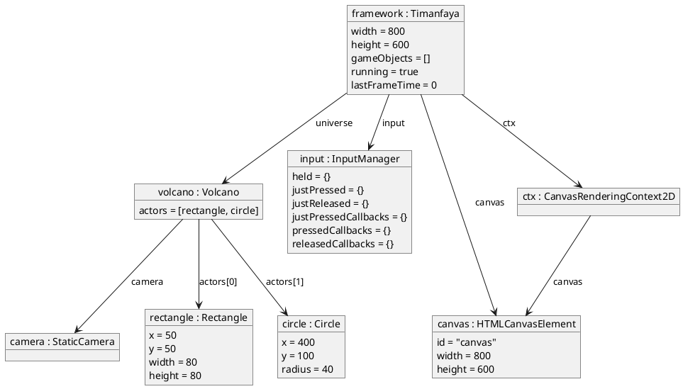

# Object diagram

Snapshot of `volcano.ts` right after `framework.start()` has called `init()` (before the first frame).

```plantuml
@startuml

object "volcano : Volcano" as volcano {
  actors = [rectangle, circle]
}

object "camera : StaticCamera" as camera

object "framework : Timanfaya" as framework {
  width = 800
  height = 600
  gameObjects = []
  running = true
  lastFrameTime = 0
}

object "input : InputManager" as input {
  held = {}
  justPressed = {}
  justReleased = {}
  justPressedCallbacks = {}
  pressedCallbacks = {}
  releasedCallbacks = {}
}

object "canvas : HTMLCanvasElement" as canvas {
  id = "canvas"
  width = 800
  height = 600
}

object "ctx : CanvasRenderingContext2D" as ctx

object "rectangle : Rectangle" as rectangle {
  x = 50
  y = 50
  width = 80
  height = 80
}

object "circle : Circle" as circle {
  x = 400
  y = 100
  radius = 40
}

framework --> volcano : universe
framework --> input : input
framework --> canvas : canvas
framework --> ctx : ctx
ctx --> canvas : canvas
volcano --> camera : camera
volcano --> rectangle : actors[0]
volcano --> circle : actors[1]

@enduml
```
