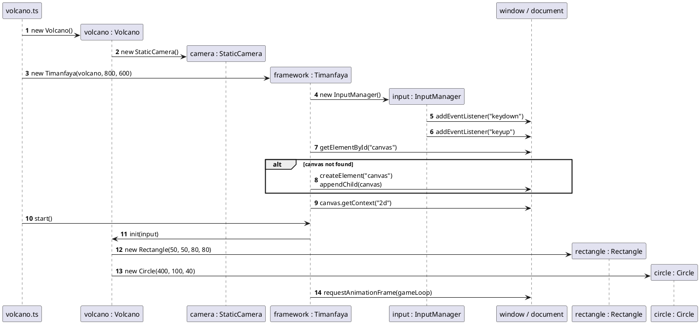
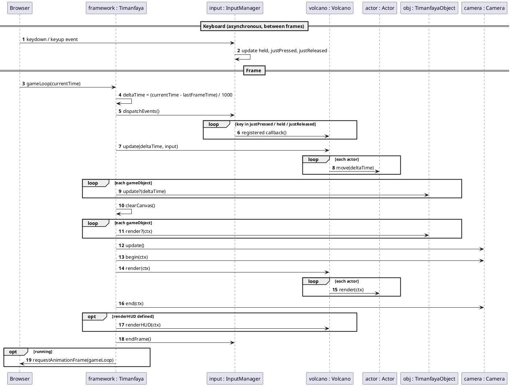

# Sequence diagram

## Startup

```plantuml
@startuml
autonumber

participant "volcano.ts" as main
participant "volcano : Volcano" as volcano
participant "camera : StaticCamera" as camera
participant "framework : Timanfaya" as framework
participant "input : InputManager" as input
participant "window / document" as dom
participant "rectangle : Rectangle" as rect
participant "circle : Circle" as circle

main -> volcano ** : new Volcano()
volcano -> camera ** : new StaticCamera()

main -> framework ** : new Timanfaya(volcano, 800, 600)
framework -> input ** : new InputManager()
input -> dom : addEventListener("keydown")
input -> dom : addEventListener("keyup")
framework -> dom : getElementById("canvas")
alt canvas not found
  framework -> dom : createElement("canvas")\nappendChild(canvas)
end
framework -> dom : canvas.getContext("2d")

main -> framework : start()
framework -> volcano : init(input)
volcano -> rect ** : new Rectangle(50, 50, 80, 80)
volcano -> circle ** : new Circle(400, 100, 40)
framework -> dom : requestAnimationFrame(gameLoop)

@enduml
```

## One frame of the game loop

```plantuml
@startuml
autonumber

participant "Browser" as browser
participant "framework : Timanfaya" as framework
participant "input : InputManager" as input
participant "volcano : Volcano" as volcano
participant "actor : Actor" as actor
participant "obj : TimanfayaObject" as obj
participant "camera : Camera" as camera

== Keyboard (asynchronous, between frames) ==
browser -> input : keydown / keyup event
input -> input : update held, justPressed, justReleased

== Frame ==
browser -> framework : gameLoop(currentTime)
framework -> framework : deltaTime = (currentTime - lastFrameTime) / 1000

framework -> input : dispatchEvents()
loop key in justPressed / held / justReleased
  input -> volcano : registered callback()
end

framework -> volcano : update(deltaTime, input)
loop each actor
  volcano -> actor : move(deltaTime)
end
loop each gameObject
  framework -> obj : update?(deltaTime)
end

framework -> framework : clearCanvas()
loop each gameObject
  framework -> obj : render?(ctx)
end

framework -> camera : update()
framework -> camera : begin(ctx)
framework -> volcano : render(ctx)
loop each actor
  volcano -> actor : render(ctx)
end
framework -> camera : end(ctx)
opt renderHUD defined
  framework -> volcano : renderHUD(ctx)
end

framework -> input : endFrame()
opt running
  framework -> browser : requestAnimationFrame(gameLoop)
end

@enduml
```
