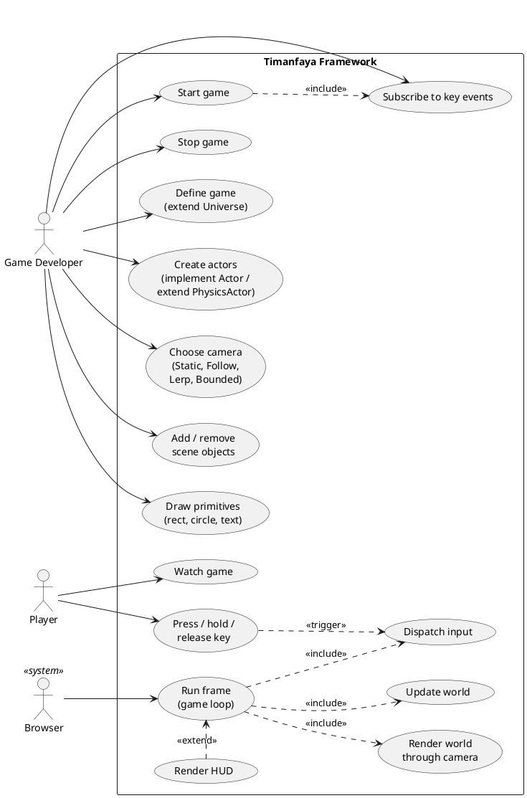

# Use case diagram

```plantuml
@startuml
left to right direction

actor "Game Developer" as dev
actor "Player" as player
actor "Browser" as browser <<system>>

rectangle "Timanfaya Framework" {
  usecase "Define game\n(extend Universe)" as UC_define
  usecase "Create actors\n(implement Actor /\nextend PhysicsActor)" as UC_actors
  usecase "Choose camera\n(Static, Follow,\nLerp, Bounded)" as UC_camera
  usecase "Subscribe to key events" as UC_subscribe
  usecase "Add / remove\nscene objects" as UC_objects
  usecase "Draw primitives\n(rect, circle, text)" as UC_draw
  usecase "Start game" as UC_start
  usecase "Stop game" as UC_stop

  usecase "Press / hold /\nrelease key" as UC_key
  usecase "Watch game" as UC_watch

  usecase "Run frame\n(game loop)" as UC_frame
  usecase "Dispatch input" as UC_dispatch
  usecase "Update world" as UC_update
  usecase "Render world\nthrough camera" as UC_render
  usecase "Render HUD" as UC_hud
}

dev --> UC_define
dev --> UC_actors
dev --> UC_camera
dev --> UC_subscribe
dev --> UC_objects
dev --> UC_draw
dev --> UC_start
dev --> UC_stop

player --> UC_key
player --> UC_watch

browser --> UC_frame

UC_start ..> UC_subscribe : <<include>>
UC_frame ..> UC_dispatch : <<include>>
UC_frame ..> UC_update : <<include>>
UC_frame ..> UC_render : <<include>>
UC_hud .> UC_frame : <<extend>>
UC_key ..> UC_dispatch : <<trigger>>

@enduml
```
